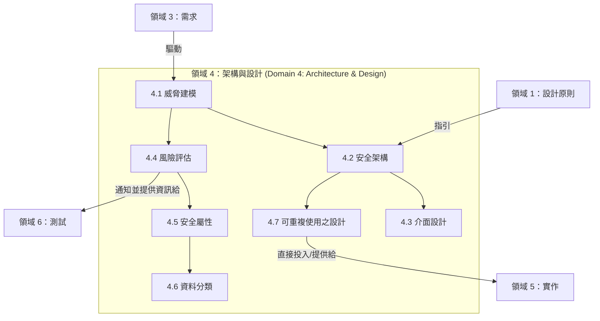

# 領域 4：安全軟體架構與設計 (Domain 4: Secure Software Architecture & Design) (14%)

## 領域概觀 (Domain Overview)

領域 4 涵蓋了**如何設計並架構安全的軟體 (how to design and architect secure software)**。這是在考試中佔最高權重 (14%) 的一個領域，它在安全需求（領域 3）與安全實作（領域 5）之間搭起了一座橋樑。主題涵蓋了從攻擊面評估、威脅建模 (threat modeling) 一直到安全設計模式、技術選擇以及架構文件記錄等。

本領域在考試中佔有 **14% 的權重**，並包含 **7 個主要章節**：

| 章節 | 標題 | 重點 |
|---------|-------|-------|
| 4.1 | 執行威脅建模 (Perform Threat Modeling) | STRIDE, DREAD, 攻擊樹 (attack trees), 資料流程圖 (DFD) |
| 4.2 | 定義安全架構 (Define the Security Architecture) | 安全控制項、預設安全、隔離、信任邊界 |
| 4.3 | 執行安全介面設計 (Performing Secure Interface Design) | API 安全性、輸入驗證、契約式設計 (contract design) |
| 4.4 | 執行架構層級的風險評估 (Performing Architectural Risk Assessment) | 攻擊面評估、風險排序/分級 |
| 4.5 | 塑造 (非功能性) 安全屬性與限制的模型 (Model Security Properties and Constraints) | 在架構層級落實機密性、完整性、可用性、認證與授權等屬性 |
| 4.6 | 資料建模與分類 (Model and Classify Data) | 在設計階段進行資料建模與分類 |
| 4.7 | 評估並選擇可重複使用的安全設計 (Evaluate and Select Reusable Secure Design) | 框架、平台、安全設計模式 (secure design patterns) |

## 學習目標 (Learning Objectives)

完成本領域的學習後，您應該能夠：

- 運用 STRIDE、DREAD 以及攻擊樹來執行威脅建模
- 設計包含適當安全控制項的安全架構
- 設計安全的介面與 API
- 評估並縮小軟體的攻擊面 (attack surfaces)
- 在架構層級針對安全屬性與資料分類進行建模
- 選擇安全的設計模式與可重複使用的框架

## 關鍵關聯性 (Key Relationships)

## 備考提示 (Study Tips)

> **考試重點**：本領域以 **14%** 的佔比成為考試中**權重最高的領域**。威脅建模 (STRIDE/DREAD)、攻擊面分析，以及安全設計模式是非常熱門的考點。請預期會出現許多情境題，要求你辨識出正確的威脅類別或是最適當的設計模式。

- 熟記 **STRIDE** 是如何對應到 CIA + 認證 (AuthN) + 授權 (AuthZ) + 不可否認性 (Nonrepudiation) 的 — 把對應關係背下來。
- **DREAD** 是一個風險評級模型 (risk rating model) — 必須了解它包含的五個評估要素。
- 為了威脅建模，必須了解 DFD (資料流程圖) 的四大構成要素：處理程序 (processes)、資料儲存 (data stores)、資料流向 (data flows) 以及信任邊界 (trust boundaries)。
- 要能區分 **信任邊界 (trust boundaries)** 與 **安全領域 (security domains)** 之間的不同。
- **安全的設計模式 (Secure design patterns)**（例如：輸入驗證、例外權處理）是考試中頻繁出現的考題。

## 本章節包含的檔案

| 檔案 | 內容 |
|------|---------|
| [4.1_threat_modeling.md](4.1_threat_modeling.md) | STRIDE, DREAD, 攻擊樹, DFDs, 威脅建模流程 |
| [4.2_security_architecture.md](4.2_security_architecture.md) | 安全控制項、預設安全、信任邊界、隔離 |
| [4.3_secure_interface_design.md](4.3_secure_interface_design.md) | API 安全性、輸入驗證、安全契約 (secure contracts) |
| [4.4_architectural_risk_assessment.md](4.4_architectural_risk_assessment.md) | 攻擊面評估、風險排序/分級 |
| [4.5_security_properties_constraints.md](4.5_security_properties_constraints.md) | 架構層級的非功能性安全屬性 |
| [4.6_data_modeling_classification.md](4.6_data_modeling_classification.md) | 位於設計階段的資料建模與分類 |
| [4.7_reusable_secure_design.md](4.7_reusable_secure_design.md) | 設計模式 (Design patterns)、框架、平台選擇 |
