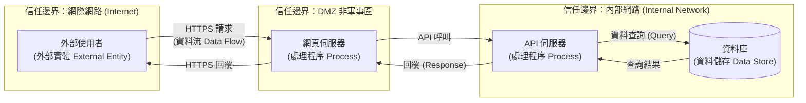
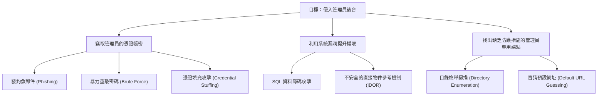

# 4.1 執行威脅建模 (Perform Threat Modeling)

## 學習目標

- 解釋威脅建模的目的與流程
- 應用 STRIDE 模型對威脅進行分類
- 使用 DREAD 模型對威脅嚴重性進行評等 (rating)
- 建構用於威脅分析的攻擊樹 (attack trees) 與資料流程圖 (DFD)
- 描述各種威脅建模方法論（例如 PASTA, VAST）

---

## 什麼是威脅建模 (Threat Modeling)？

威脅建模是一個用以識別、分類並優先處理軟體系統潛在威脅的**結構化流程**。這項工作是在 SDLC 的**設計階段 (design phase)** 進行，並且應該在整個軟體生命週期中持續維持更新。

### 何時該執行威脅建模

| 時機 | 活動/行動 |
|--------|----------|
| **設計階段 (Design phase)** | 建立最初、最全面的威脅模型 |
| **架構發生變更時** | 當系統設計發生重大變動時進行更新 |
| **新增功能時** | 針對新加入的功能及其交互作用進行威脅建模 |
| **事件回應 (Incident response) 後** | 在發生資安事件後檢討並更新威脅模型 |
| **定期審查 (Periodic review)** | 定期的覆核（至少每年一次）以應對不斷演進變化的威脅環境 |

### 威脅建模流程

---

## STRIDE 威脅分類模型

**STRIDE** 是由微軟開發的一套**幫助記憶的威脅分類模型 (mnemonic threat classification model)**。其中的縮寫字母各自代表著一種類別的威脅，並且分別對應到違反了哪一項特定的安全屬性能力：

| 威脅 (Threat) | 所違反的安全屬性 | 說明 | 範例 |
|--------|---------------------------|-------------|---------|
| **S**poofing (偽冒) | 認證 (Authentication) | 假冒成其他人或其他事物的身分 | 偽造身分驗證權杖 (tokens) |
| **T**ampering (竄改) | 完整性 (Integrity) | 未經授權地修改資料或程式碼 | 塗改資料庫紀錄、修改組態設定檔 |
| **R**epudiation (否認) | 不可否認性 (Nonrepudiation) | 執行了某項操作後卻矢口否認有做過 | 明明下了單購買卻聲稱沒這回事 |
| **I**nformation Disclosure (資訊外洩) | 機密性 (Confidentiality) | 將資訊暴露給未經授權的個人方 | 系統錯誤訊息直接把堆疊追蹤 (stack traces) 傾印印在畫面上 |
| **D**enial of Service (阻斷服務) | 可用性 (Availability) | 使系統癱瘓無法使用或效能嚴重衰退 | 用海量的請求灌爆伺服器 |
| **E**levation of Privilege (權限提升) | 授權 (Authorization) | 在未獲授權的情況下取得更高的存取能力 | 利用系統漏洞設法取得系統管理員 (admin) 的權限 |

### 針對系統各種元素的 STRIDE 分析 (STRIDE-per-Element)

當把 STRIDE 應用在 DFD (資料流程圖) 上時，某些特定威脅只適用於某些特定類型的元素：

| DFD 元素分類 | S | T | R | I | D | E |
|-------------|:-:|:-:|:-:|:-:|:-:|:-:|
| **外部實體 (External Entity)** | ✓ | | ✓ | | | |
| **處理程序 (Process)** | ✓ | ✓ | ✓ | ✓ | ✓ | ✓ |
| **資料儲存 (Data Store)** | | ✓ | ✓ | ✓ | ✓ | |
| **資料流 (Data Flow)** | | ✓ | | ✓ | ✓ | |

> **考試提示**：只有**處理程序 (processes)** 才對所有的六種 STRIDE 威脅皆具有脆弱性。資料儲存 (Data stores) 與資料流 (data flows) 則是**不會**直接遭受 Spoofing (偽冒) 或 Elevation of Privilege (權限提升) 攻擊的。

---

## DREAD 風險評等 (Risk Rating)

**DREAD** 是一個用來**替已識別出來的威脅排定優先順序**的風險評級模型。它會針對下列各項因素進行評分數字量化（通常是 1–3 分或 1–10 分），再將各項得分加總平均：

| 因素 (Factor) | 試圖回答的問題 |
|--------|----------|
| **D**amage Potential (潛在損壞程度) | 如果這個攻擊成功了，情況會有多糟糕？ |
| **R**eproducibility (可重現性) | 重現這個攻擊手法有多容易？ |
| **E**xploitability (可利用性) | 成功發動這項攻擊需要多少努力、資源或專業知識？ |
| **A**ffected Users (受影響使用者) | 會有多少使用者遭遇波及衝擊？ |
| **D**iscoverability (可發現性) | 攻擊者發現這個漏洞點的難易程度為何？ |

### DREAD 評分範例

| 威脅 | D(損害) | R(重現性) | E(利用性) | A(受影響者) | D(發現性) | **平均得分** |
|--------|:------:|:---------------:|:--------------:|:--------------:|:---------------:|:----------:|
| 在登入框下 SQL Injection | 3 | 3 | 2 | 3 | 3 | **2.8** |
| 在留言板下 XSS | 2 | 3 | 2 | 2 | 2 | **2.2** |
| 針對 API 端點打 DDoS | 2 | 1 | 1 | 3 | 2 | **1.8** |

加總平均得分越高 = 越需要優先被處理緩解。

---

## 資料流程圖 (Data Flow Diagrams, DFDs)

DFD 是威脅建模過程中**最基礎的核心產出物 (foundational artifact)**。它們能視覺化資料是如何在系統中移動穿梭的，並協助標示出信任邊界大門的確切位置。

### DFD 基本元素

| 元素 | 繪圖符號 | 說明 |
|---------|--------|-------------|
| **外部實體 (External Entity)** | 矩形 | 使用者、外部系統，或是存在於系統邊界之外的其他服務 |
| **處理程序 (Process)** | 圓形/圓角矩形 | 用來轉換或處理資料的程式碼或服務 |
| **資料儲存 (Data Store)** | 兩條平行線 | 資料庫、檔案、佇列 (queue) 或是其他資料儲存庫 |
| **資料流向 (Data Flow)** | 箭頭 | 資料在各元素之間移動的方向軌跡 |
| **信任邊界 (Trust Boundary)** | 虛線 | 劃分不同信任等級區域間的界線（例如：網際網路 vs. 公司內部網路） |

### DFD 階層架構 (DFD Levels)

| 階層級別 | 細節程度 |
|-------|--------|
| **Level 0** (系統脈絡圖/Context Diagram) | 這是最高視角。將整個系統視為一個極簡的單一處理程序 (process)，並畫出所有會與之互動的外部實體 |
| **Level 1** | 將單一系統大卸八塊，拆解分解為其內含的主要子系統/元件大塊 |
| **Level 2** | 進一步把各個子系統分解為更詳細入微的個別處理程序 (individual processes) |

---

## 攻擊樹 (Attack Trees)

攻擊樹提供了一種**結構化、階層樹狀圖 (hierarchical representation)** 的方式，用來呈現對系統發動潛在攻擊的各種手法與路徑。最頂端的根節點 (root node) 代表攻擊者的終極目標，而枝葉節點 (leaf nodes) 則代表為了達到該目標所需經歷的個別步驟或條件。

**關鍵概念：**
- **AND 節點**：必須所有子條件都成立 (為真)，上一層的父節點目標才能被達成。
- **OR 節點**：只要有任何一個子條件成立，就能達成上一層的任務目標（這通常是預設情況）。
- 攻擊樹能夠協助找出防禦最薄弱的**成本最低、最容易被攻破**的攻擊路徑。

---

## 其他威脅建模方法論 (Other Threat Modeling Methodologies)

### PASTA（攻擊模擬與威脅分析流程）

一套**分為七個階段，且以「企業風險為中心 (risk-centric)」** 的威脅建模方法論：

| 階段 | 活動 |
|-------|----------|
| 1. 定義目標 | 營運衝擊分析 (BIA)、安全需求盤點 |
| 2. 定義技術範圍 | 架構分析、科技生態描繪/技術剖析 (technology profiling) |
| 3. 分解應用程式 | 繪製 DFD、劃出信任邊界、找出系統各個進入點 |
| 4. 威脅分析 | 結合威脅情資 (threat intelligence)、提取攻擊特徵庫 |
| 5. 漏洞分析 | 找出各種漏洞與先前整理出的威脅情境的關聯對應性 |
| 6. 攻擊建模 | 開發/列出攻擊樹 (attack tree)，並進行實際的模擬演練 |
| 7. 風險與衝擊分析 | 估算殘餘風險 (residual risk) 並定出針對性的對策與解法 (countermeasure) |

### VAST（視覺、敏捷且簡單的威脅）

一種專為**敏捷 (Agile) 開發環境**而設計、且能擴展到全企業落實的方法論：
- **應用程式威脅模型**：專門給開發人員看的 (使用 process-flow 圖解)。
- **維運層級威脅模型**：專門給基礎設施 (infrastructure) 團隊看的 (使用 DFDs)。
- 非常順滑地無縫融入到 Agile sprints 衝刺會議與 CI/CD 管線的節奏中。

---

## 考試重點

1. **STRIDE 的六個組成字母代表什麼**：Spoofing(偽冒), Tampering(竄改), Repudiation(否認), Info Disclosure(資訊外洩), DoS(阻斷服務), Elevation of Privilege(權限提升)。
2. **STRIDE 又是對應到哪種資安屬性遭破壞 (常考)**：S→AuthN(認證), T→Integrity(完整性), R→Nonrepudiation(不可否認性), I→Confidentiality(機密性), D→Availability(可用性), E→AuthZ(授權)。
3. **STRIDE-per-element (針對畫在 DFD 上的元素)**：要背起來，只有「處理程序 (processes)」會遭受全部共六種類別的威脅。
4. **DREAD 的五大評估要素**：Damage (損害程度), Reproducibility (重現性), Exploitability (利用難易度), Affected Users (受影響人數), Discoverability (可發現難易度)。
5. **DFD (資料流程圖) 元素代表意義**：外部實體 (矩形), 處理程序 (圓圈), 資料儲存庫 (平行線), 資料流向 (實心箭頭), 信任邊界 (虛線)。
6. **攻擊樹 (Attack trees)**：根 (Root) = 最終目標；葉 (leaves) = 具體攻擊步驟；結合邏輯閘 AND/OR 的樹狀結構判定關係。
7. **威脅建模的執行時機**：最佳實施時期為「設計階段 (Design phase)」，並在系統產生變更時持續隨之更新。

---

## 關鍵術語表

| 術語 | 定義 |
|------|-----------|
| **Threat Modeling (威脅建模)** | 一套用於有系統性地識別出並將目標系統可能遭受的各種威脅排定優先順序的結構化流程 |
| **STRIDE** | 微軟提出的威脅分類模型縮寫：Spoofing(偽冒)、Tampering(竄改)、Repudiation(否認)、Information Disclosure(資訊外洩)、DoS(阻斷服務)、Elevation of Privilege(權限提升) |
| **DREAD** | 微軟提出的風險評分量化模型，五個縮寫代表：Damage(損害)、Reproducibility(重現性)、Exploitability(可利用性)、Affected Users(受波及的使用者)、Discoverability(可發現性) |
| **DFD** | Data Flow Diagram (資料流程圖) — 用來視覺化描繪資料是如何在一整套系統各元件之間流動交換的視圖 |
| **Trust Boundary (信任邊界)** | 在系統架構中，用來劃分隔開不同信任等級網段/區域那一條無形的虛線 |
| **Attack Tree (攻擊樹)** | 以階層化架構圖解各種要抵達/滿足最終攻擊目標之層層路徑的邏輯分析圖表 |
| **PASTA** | Process for Attack Simulation and Threat Analysis (攻擊模擬與威脅分析流程) — 一套包含七個階段、主打以風險為出發點的方法論 |
| **VAST** | Visual, Agile, Simple Threat (視覺、敏捷且簡單的威脅建模法) — 主打強調高度兼容且完全匹配 Agile (敏捷) 開發生態系的建模方法 |
