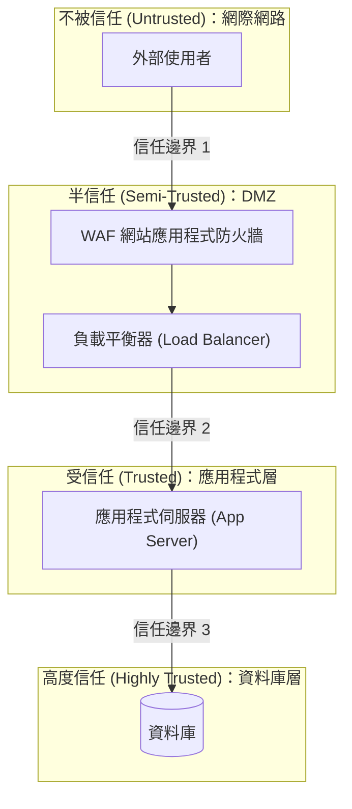

# 4.2 定義安全架構 (Define the Security Architecture)

## 學習目標

- 描述安全架構的各項原則及其應用
- 解釋安全控制措施 (security controls) 及其在架構中所扮演的角色
- 定義信任邊界 (trust boundaries) 與安全領域 (security domains)
- 應用預設安全 (secure defaults)、失效安全 (fail-secure)、與隔離 (isolation) 原則
- 了解可信賴運算基底 (TCB, Trusted Computing Base) 與參考監視器 (reference monitor) 的概念

---

## 安全架構基礎

安全架構定義了**安全控制措施在整體系統架構中是如何被結構化、定位以及整合的**。它將紙本的安全需求，轉化為實際的架構設計決策。

### 安全架構的組成元素

| 元素 | 說明 |
|-----------|-------------|
| **安全領域 (Security domains)** | 具備相同安全需求之資源的邏輯分組/群組 |
| **信任邊界 (Trust boundaries)** | 劃分隔開不同安全領域或信任等級的界線 |
| **安全控制項 (Security controls)** | 用來強制執行安全政策的具體機制 |
| **安全服務 (Security services)** | 提供安全能力 (如身分認證 AuthN、授權 AuthZ、日誌記錄) 的共用/共享服務 |
| **安全區域 (Security zones)** | 具有明確安全政策規範的網路區段 (network segments) |

---

## 核心架構原則 (Core Architecture Principles)

### 預設安全 (Secure Defaults)

系統在**預設組態下就應該是安全無虞的**。當使用者全盤接受所有預設值時，他們最終應該會得到一個安全的系統。

| 原則 | 實務應用 |
|-----------|------------|
| **預設拒絕 (Deny by default)** | 除非有被明確授權允許，否則一律拒絕所有存取請求 |
| **預設僅啟用最少功能 (Minimum features enabled)** | 只開啟絕對必備的功能；將其他所有非必要功能預設關閉 |
| **強悍的預設設定 (Strong default settings)** | 預設使用強加密、較短的工作階段逾時時間 (session timeouts)，並預設啟用 MFA |
| **禁止使用預設憑證 (No default credentials)** | 強制要求使用者在初次登入時必須更改密碼 |

### 失效安全 (Fail-Secure / Fail-Closed)

當系統遭遇到錯誤或發生故障時，它應該要**退回到一個安全的狀態 (default to a secure state)**，而不是門戶大開變成開放狀態。

| 故障模式 | 說明 | 範例 |
|-------------|-------------|---------|
| **失效安全 (Fail-secure / Fail-closed)** | 系統在發生故障時會拒絕所有存取 | 防火牆若當機崩潰，會直接丟棄所有封包流量 |
| **失效開放 (Fail-open)** | 系統在發生故障時會允許/放行存取 | 停電時電子門鎖會自動解鎖 (基於消防安全考量) |

> **考試提示**：**失效安全 (Fail-secure)** 是**資安系統的預設準則**。只有在人員生命安全 (life safety) 的優先級高於資訊安全時，才會採用失效開放 (Fail-open) 設計。

### 完整仲裁/全面中介 (Complete Mediation)

**每一次的存取請求**都必須經過存取控制機制的檢查驗證 — 嚴禁任何繞過行為，且在未經適當驗證的情況下，禁止快取 (caching) 先前的授權決策結果。

### 機制經濟性 (Economy of Mechanism)

安全機制應該要**盡可能保持簡單**。越複雜的機制，越容易隱藏錯誤 (bugs)，且越難以驗證其正確性。

### 最小共用機制 (Least Common Mechanism)

盡量減少讓使用者之間共用/共享底層機制。共享資源會產生意想不到的資訊外洩管道 (隱蔽通道/covert channels) 或導致互相干擾干涉。

### 權限分離 (Separation of Privilege)

要求必須滿足**多個條件**後才能授予存取權限。這正是 MFA (多因素認證) 與職責分離 (separation of duties) 背後的核心原則。

### 最小權限 (Least Privilege)

僅授予執行特定任務所必需的**最低限度權限**。這樣做可以限制任何被攻陷/妥協事件發生時的「爆炸半徑/影響範圍 (blast radius)」。

---

## 信任邊界與安全領域 (Trust Boundaries and Security Domains)

### 信任邊界

在系統元件或網路之間，只要**信任等級發生改變**的地方，就會存在信任邊界：

### 信任邊界的關鍵規則

| 規則 | 說明 |
|------|-------------|
| **驗證所有輸入 (Validate all input)** | 凡是跨越信任邊界流入的資料，都必須經過驗證、清洗 (sanitized) 與正規化 (canonicalized) |
| **認證所有的請求 (Authenticate requests)** | 每當跨越一次信任邊界，都必須驗證其身分 |
| **傳輸中加密 (Encrypt in transit)** | 當資料跨越信任邊界流動時，必須加以保護 |
| **記錄邊界跨越行為 (Log boundary crossings)** | 記錄並監控穿越信任邊界的行為軌跡 |
| **最小化邊界跨越次數 (Minimize boundary crossings)** | 盡量減少信任邊界轉換/交接的次數 |

---

## 隔離與分區 (Isolation and Compartmentalization)

| 概念 | 說明 |
|---------|-------------|
| **處理程序隔離 (Process isolation)** | 每個處理程序都在自己專屬的記憶體空間中執行；一個程序無法存取另一個程序的記憶體 |
| **沙盒 (Sandboxing)** | 在一個受限的環境中執行程式碼，嚴格限制其存取系統資源的能力 |
| **容器化 (Containerization)** | 將應用程式及其依賴套件打包在一起；將其與主機 (host) 及其他容器隔離開來 |
| **虛擬化 (Virtualization)** | 在一台實體主機上運行多個虛擬機 (VM)，每個 VM 皆由 Hypervisor 予以隔離 |
| **微服務 (Microservices)** | 將龐大的應用程式拆解為許多小巧、可獨立部署的服務 |
| **網路分段隔離 (Network segmentation)** | 將網路劃分為多個區段 (segments)，並對區段間的互相存取實施嚴格控制 |

---

## 可信賴運算基底 (TCB) 與參考監視器 (Reference Monitor)

### 可信賴運算基底 (TCB, Trusted Computing Base)

TCB 是一個運算系統內部用以強制執行安全政策的**所有安全機制之總和**：
- 包含所有被信任用來執行維護安全性的硬體、韌體與軟體。
- 如果 TCB 中的任何一部分遭到攻陷/妥協，整個系統的安全政策架構就會隨之瓦解。
- TCB 應該要保持**越小越好 (as small as possible)**（符合「機制經濟性」原則）。

### 參考監視器 (Reference Monitor)

參考監視器是一個**抽象概念 (abstract concept)**，負責仲裁並中介主體對客體的所有存取行為：

| 屬性 | 說明 |
|----------|-------------|
| **必定被呼叫 (Always invoked)** | 絕對無法被繞過 — 所有的存取都必須通過它（完整仲裁） |
| **防竄改 (Tamper-proof)** | 無法被任何未經授權的實體更改或破壞 |
| **小到足以被驗證 (Small enough to verify)** | 結構必須夠簡單，才能進行正規的形式化驗證 (formally verified) 證明其正確無誤 |

而**安全核心 (security kernel)** 便是將這個抽象的參考監視器概念，實際落實為硬體、韌體與軟體的具體實作 (implementation)。

---

## 安全模型 (Security Models)

| 模型 | 關注焦點 | 規則 |
|-------|-------|------|
| **Bell-LaPadula (BLP)** | 機密性 (Confidentiality) | 不可向上讀取 (no read up - 簡單安全屬性)；不可向下寫入 (no write down - 星號屬性) |
| **Biba** | 完整性 (Integrity) | 不可向下讀取 (no read down - 簡單完整性屬性)；不可向上寫入 (no write up - 星號完整性屬性) |
| **Clark-Wilson** | 商業上的完整性 | 透過存取三元組 (Access triple) 來達成格式正確的交易 (Well-formed transactions)：使用者 (User) → 程式 (TP) → 資料 (CDI) |
| **Brewer-Nash (中國牆 Chinese Wall)** | 避免利益衝突 | 防止存取會引發利益衝突 (conflict of interest) 狀況的相關資源 |

> **考試提示**：BLP = **機密性** (不可向上讀取，不可向下寫入)。Biba = **完整性** (不可向下讀取，不可向上寫入)。它們兩者的規則是**完全顛倒/成反比的 (inversions)**。

---

## 考試重點

1. **預設安全 (Secure defaults)**：預設拒絕、啟用最少功能、禁用預設寫死的帳密。
2. **失效安全 (Fail-secure) vs. 失效開放 (Fail-open)**：失效安全 = 發生故障時拒絕存取（這是資安系統必備的預設行為）。
3. **完整仲裁 (Complete mediation)**：每一次的存取都必須經過檢查 — 不能有捷徑/繞過。
4. **信任邊界 (Trust boundaries)**：在每一次跨越邊界時都要進行：輸入驗證、身分認證、加密。
5. **TCB (可信賴運算基底)**：安全機制的總和；必須維持小巧且經過驗證。
6. **參考監視器 (Reference monitor)**：必定被呼叫、具備防竄改能力、且可被驗證。
7. **BLP vs. Biba**：BLP = 機密性 (禁止向上讀取)；Biba = 完整性 (禁止向下讀取)。
8. **Clark-Wilson 模型**：專注於格式正確的交易 (well-formed transactions) 以及存取三元組 (User → TP程式 → CDI資料)。

---

## 關鍵術語表

| 術語 | 定義 |
|------|-----------|
| **Security Architecture (安全架構)** | 系統內安全控制措施的結構佈局與整合方式 |
| **Trust Boundary (信任邊界)** | 系統中劃分隔開不同信任等級網段/區域間的界線 |
| **Security Domain (安全領域)** | 共用/套用同一套安全需求規定的資源邏輯群組 |
| **Fail-Secure (失效安全)** | 在發生故障或錯誤時，系統會自動退回到安全 (通常是拒絕存取) 狀態的設計 |
| **Complete Mediation (完整仲裁/全面中介)** | 在授予存取權限之前，針對每一個單獨的請求強制進行身分與存取授權檢查 |
| **TCB** | Trusted Computing Base (可信賴運算基底) — 一部機器內所有負責執行安全政策防護機制的總和 |
| **Reference Monitor (參考監視器)** | 負責仲裁所有主體對客體存取行為的抽象概念機制 |
| **Security Kernel (安全核心)** | 參考監視器 (Reference Monitor) 在硬體與軟體上的具體功能實作 |
| **BLP** | Bell-LaPadula model — 專注於強制落實「機密性 (confidentiality)」的安全模型 |
| **Biba** | Biba model — 專注於強制落實「完整性 (integrity)」的安全模型 |
| **Clark-Wilson** | 使用格式正確的交易 (well-formed transactions) 來維護商業資料完整性的模型 |
| **Sandboxing (沙盒)** | 在一個受到嚴格權限限制的隔離環境中執行程式碼 |
