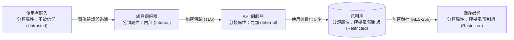

# 4.6 資料建模與分類 (Model and Classify Data)

## 學習目標

- 將資料分類 (data classification) 原則應用於架構設計決策中
- 解釋有助於提升安全性的資料建模 (data modeling) 技巧
- 描述資料流分析 (data flow analysis) 及其在識別安全需求上所扮演的角色
- 根據資料分類級別，定義相應的資料保護控制措施

---

## 為了安全性進行資料建模 (Data Modeling for Security)

在資訊安全的脈絡下，資料建模的主要目的是：依據資料的分類級別，盤點出**系統內存在哪些資料、資料流向何處、資料如何被儲存，以及這些資料需要什麼程度的保護**。

### 資料盤點目錄 (Data Inventory)

| 元素 | 說明 |
|---------|-------------|
| **資料元素 (Data element)** | 特定的資料項目（例如：客戶姓名 `customer_name`、社會安全碼 `SSN`、信用卡號 `credit_card_number`） |
| **分類 (Classification)** | 資料的敏感度等級（如：公開、內部、機密、極機密/限制級） |
| **擁有者 (Owner)** | 對該資料負有最終責任的業務端利害關係人 |
| **位置 (Location)** | 資料實際存放的地方（如：資料庫、檔案系統、雲端儲存） |
| **保護措施 (Protection)** | 基於該資料之分類級別所強制要求的安全控制項 |
| **保留期限 (Retention)** | 該資料依法令或業務需求必須被保存多久 |

### 出於安全考量的實體關聯 (ER) 建模

實體關聯模型 (Entity-Relationship models) 描述了**資料實體之間的關聯性**。從資安的視角來看，這可以幫助我們：
- 識別出究竟是哪些實體包含了**敏感資料 (sensitive data)**
- 透過描繪關聯性，了解資料是否會經由相關聯的實體產生**非預期的曝露 (data exposure)**
- 決定哪些實體間的關聯路徑需要實施額外的**存取控制 (access controls)**
- 識別**連鎖反應風險 (cascading risks)** — 例如某個實體遭攻陷後，是否會連帶導致其他相關實體也跟著淪陷

---

## 資料流分析 (Data Flow Analysis)

資料流分析透過繪製出**資料在系統中是如何移動穿梭的**軌跡，藉以找出必須部署安全控制措施的防護攔截點：

### 沿著資料流佈局的安全控制項

| 資料流端點/階段 | 對應的安全控制項 |
|----------------|-----------------|
| **資料輸入 (Data entry)** | 輸入驗證、正規化 (canonicalization)、強制驗證內容類型 (content type) |
| **處理過程 (Processing)** | 存取控制 (存取權限檢查)、完整性校驗、例外/錯誤處理機制 |
| **靜態儲存 (Storage)** | 落地加密/靜止資料加密 (Encryption at rest)、針對儲存設備的存取控制、備份檔案加密 |
| **網路傳輸 (Transmission)** | 傳輸中加密 (TLS)、雙向身分驗證 (mTLS) |
| **畫面顯示 (Display)** | 輸出編碼 (Output encoding)、資料遮罩 (data masking/隱碼)、基於權限的過濾 (只顯示有權看的欄位) |
| **生命終期銷毀 (Disposal)** | 安全刪除 (Secure deletion)、儲存媒體實體銷毀與清理 (media sanitization) |

---

## 基於分類級別的保護控制措施 (Classification-Based Protection Controls)

以普遍常見的四級分類架構為例，各級別對應的強制基準要求如下：

| 分類級別 | 存取控制 (Access Control) | 加密要求 (Encryption) | 日誌記錄 (Logging) | 銷毀方式 (Disposal) |
|---------------|---------------|-----------|---------|----------|
| **公開 (Public)** | 無限制 | 非必要 (Optional) | 基本記錄 | 標準刪除 |
| **內部 (Internal)** | 基於角色的存取控制 (RBAC) | 建議採用 (Recommended) | 標準記錄 | 清除作業 (Clearing) |
| **機密 (Confidential)** | 須知原則 (Need-to-know) | 強制要求 (包含傳輸中與靜止儲存) | 詳細記錄 | 淨化作業 (Purging) |
| **雙特/限制級 (Restricted)** | MFA + 嚴格的須知原則 | 強制要求 (包含傳輸中、靜止儲存與備份檔) | 保留完整的稽核軌跡 | 實體破壞/粉碎 (Destroying) |

---

## 資料落地/資料駐留與資料主權 (Data Residency and Sovereignty)

在進行架構設計決策時，必須將「相對於特定司法管轄區的法規要求，**資料究竟實際被存放在哪裡**」納入通盤考量：

| 考量點 | 說明 |
|--------------|-------------|
| **資料落地/駐留 (Data residency)** | 強制規定資料必須儲存停留在某個特定地理區域或國境範圍內的法規要求 |
| **資料主權 (Data sovereignty)** | 一旦資料存放在某個國家，該資料就必須無條件服從該國的法律管轄權與搜查權 |
| **雲端服務區域 (Region) 的選擇** | 必須選擇能夠滿足法規要求的雲端服務資料中心基礎設施區域 (regions) |
| **跨區域的多節點抄寫 (Multi-region replication)** | 將資料跨國/跨區域地進行備份抄寫機制，**非常容易不小心就違反了**當地的資料落地/不可出境要求 |

---

## 考試重點

1. **資料分類主導了控制措施（Classification drives controls）**：安全保護層級的力道，必須精準匹配並對應到資料的分類級別 (絕不可過度保護或保護不足)。
2. **資料流分析 (Data flow analysis)**：用以找出在資料流動的路徑上，究竟應該在哪幾個攔截點部署哪些安全防護控制項。
3. **依分類等級制定的控制基準**：必須熟知針對每個級別（如公開 vs. 機密），在存取控制、加密、日誌留存與實體銷毀上分別需要什麼強度的作法。
4. **資料落地 (Data residency)**：在設計架構(特別是選擇雲端 Region 或是跨國備援時) 必須考量到資料實際存放位址所衍生的法律管轄權問題。
5. **資料盤點目錄 (Data inventory)**：一份盤點清單這至少必須記錄所有資料元素的：分類級別、擁有者是誰、存放在哪裡，以及該受何種保護。

---

## 關鍵術語表

| 術語 | 定義 |
|------|-----------|
| **Data Modeling (資料建模)** | 盤點、識別並記錄各項資料實體元素及其彼此間關聯性的過程 |
| **Data Flow Analysis (資料流分析)** | 描繪資料如何穿梭流經整個系統的軌跡圖，藉以精準定位出需要何種安全需求與防護的過程 |
| **Data Classification (資料分類)** | 依據資料的敏感度水準將其分級歸類的過程，藉此決定對應的合適防護要求標準 |
| **Data Residency (資料落地/駐留)** | 強制限制資料檔案只能被存放在某一個特定地理區域或國家範圍內的法規限制 |
| **Data Sovereignty (資料主權)** | 指出資料只要位處於某個國家境內，就必須完全受制並服從於該國法律管轄的原則概念 |
| **ER Model** | Entity-Relationship Model (實體關聯模型) — 用於視覺化展現資料實體以及實體間相互關聯性的圖表模型 |
