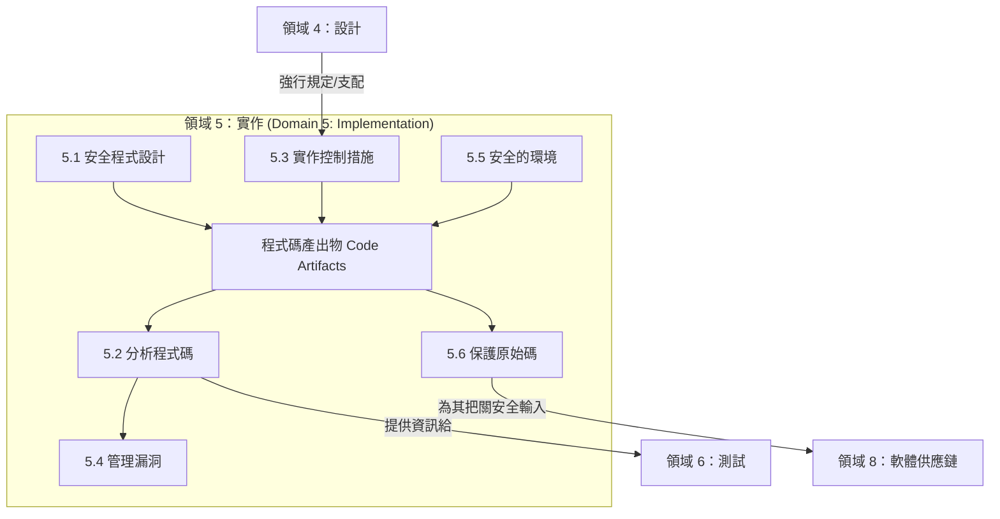

# 領域 5：安全軟體實作 (Domain 5: Secure Software Implementation) (14%)

## 領域概觀 (Domain Overview)

領域 5 從架構設計過渡到了如何安全地建置產品。這個領域涵蓋了**安全程式設計實踐 (secure coding practices)、程式碼分析、實作安全控制措施，以及保護程式碼本身**。它探討了如何在開發過程中避免常見的漏洞、如何分析程式碼找出缺陷，以及如何安全地管理整個開發環境。

本領域在考試中佔有 **14% 的權重**（與領域 4 並列為權重最高的領域），並包含 **6 個主要章節**：

| 章節 | 標題 | 重點 |
|---------|-------|-------|
| 5.1 | 應用安全程式設計實務 (Apply Secure Coding Practices) | OWASP Top 10, CWE, 狀態管理 (state management)，防範注入攻擊 (injection prevention) |
| 5.2 | 分析程式碼的安全漏洞 (Analyze Code for Security Vulnerabilities) | 程式碼審查 (Code review), SAST, DAST, SCA, 模糊測試 (fuzzing) |
| 5.3 | 實作安全控制措施 (Implement Security Controls) | 密碼學實作、身分驗證 (authentication)、權杖管理 (token management) |
| 5.4 | 管理安全漏洞 (Manage Security Vulnerabilities) | 漏洞的追蹤、分類/分診 (triage)、補救措施 (remediation)、漏洞懸賞 (bug bounties) |
| 5.5 | 應用安全環境 (Apply Secure Environments) | 環境隔離 (Environment isolation)、機密管理 (secret management)、CI/CD 安全 |
| 5.6 | 保護原始碼 (Protect Source Code) | 版本控制安全、程式碼簽章 (code signing)、存放庫(repository) 存取控制 |

## 學習目標 (Learning Objectives)

完成本領域的學習後，您應該能夠：

- 應用安全的程式設計實務來預防常見的漏洞（例如：OWASP Top 10）
- 比較並選擇合適的程式碼分析技術（如 SAST, DAST, IAST）
- 有效地實作應用程式的安全控制措施
- 透過分類 (triage) 與修補 (remediation) 流程來管理已被識別出的安全漏洞
- 保障開發與軟體建置環境 (build environments) 的安全
- 保護原始碼免於遭受未經授權的存取與竄改

## 關鍵關聯性 (Key Relationships)

## 備考提示 (Study Tips)

> **考試重點**：佔比高達 **14%**，領域 5 是考試中的重中之重。請預期會遇到大量關於 **OWASP Top 10 漏洞細節及其緩解措施** 的考題。你必須非常清楚 **SAST** 與 **DAST** 之間的差異，以及何時該使用哪一種工具。此外，關於安全環境的概念（如 CI/CD 管線安全、機密管理）在考試中出現的比重也越來越高。

- 必須對 **OWASP Top 10** 瞭若指掌：漏洞是什麼、它是如何運作的，以及該如何防範它。
- **SAST** (白箱測試) 負責**在原始碼中**抓 Bug；**DAST** (黑箱測試) 則是**在執行中的應用程式上**抓 Bug。
- 絕對不要把機密 (secrets) 寫死存放在原始碼裡面；應該要使用專門的**機密管理系統 (secrets management vaults)**。
- **程式碼簽章 (Code signing)** 可以確保最終編譯出來二進位檔的完整性 (integrity) 與不可否認性 (non-repudiation)。
- **狀態管理 (State management)**（如：工作階段/sessions、Cookie 管理）是安全程式設計中極為關鍵的考點區域。

## 本章節包含的檔案

| 檔案 | 內容 |
|------|---------|
| [5.1_secure_coding_practices.md](5.1_secure_coding_practices.md) | OWASP, CWE, 注入防護, 工作階段(Session) 管理 |
| [5.2_analyze_source_code.md](5.2_analyze_source_code.md) | 同儕審查 (Peer review), SAST, DAST, IAST, SCA |
| [5.3_security_controls.md](5.3_security_controls.md) | 認證/授權之實作, 密碼學, 資料保護 |
| [5.4_manage_vulnerabilities.md](5.4_manage_vulnerabilities.md) | 漏洞分類 (Triage), 修補 (remediation), 追蹤, 漏洞懸賞 (bug bounty) |
| [5.5_secure_environments.md](5.5_secure_environments.md) | 環境隔離, 機密管理 (secrets management), CI/CD |
| [5.6_protect_source_code.md](5.6_protect_source_code.md) | 版本控制系統安全, 分支策略 (branching strategies), 程式碼簽章 |
