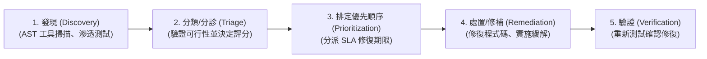

# 5.4 管理安全漏洞 (Manage Security Vulnerabilities)

## 學習目標

- 解釋漏洞管理生命週期 (vulnerability management lifecycle)
- 描述漏洞追蹤與分類/分診 (triage) 的流程
- 根據風險高低，為漏洞修復排定優先順序
- 解釋漏洞懸賞計畫 (bug bounty programs) 與負責任的漏洞揭露 (responsible disclosure) 所扮演的角色

---

## 漏洞管理生命週期 (Vulnerability Management Lifecycle)

單單只是把漏洞「找出來」只不過是第一步而已。組織必須要擁有一套系統化的流程，來負責追蹤、評估並著手修復這些漏洞。

### 1. 發現識別 (Discovery / Identification)
漏洞可以透過許多種途徑被揪出來：包含 SAST/DAST/SCA 工具掃描、人工程式碼審查、滲透測試 (penetration testing)、外部資安研究人員通報，或是原廠發布的資安通報 (vendor notifications)。

### 2. 分類與分診 (Triage)
Triage 是一個對未經處理的原始漏洞報告 (raw findings) 進行初步審查過濾的過程：
- **驗證 (Validate)**：確認該漏洞在現實中是真的打得穿 (過濾掉惱人的誤報 false positives)。
- **整併 (Consolidate)**：把重複的通報綁在一起 (例如：SAST 跟 DAST 其實抓到的是同一個問題)。
- **評定風險 (Assign Risk)**：依據該缺陷的嚴重程度與被成功利用的難易度，給予風險評分。

### 3. 排定優先順序與 SLA (Prioritization and SLAs)
並不是所有的漏洞都有辦法 (或有必要) 立刻馬上被修好。修復行動必須依據風險積壓清單 (risk backlogs) 來排定優先順序。

組織會根據漏洞的嚴重程度，明文訂定出修復的**服務級別協定 (Service Level Agreements, SLAs)**：
| 嚴重程度 (Severity) | 典型的修復 SLA 期限 | 處置行動範例 |
|----------|-----------------------------|----------------|
| **極危險 (Critical)** | < 24–48 小時 | 緊急發布修補程式 (Emergency patch)、帶外發布 (out-of-band release)，或立即採取緩解措施 (例如先上 WAF 擋住攻擊)。 |
| **高 (High)** | < 30 天 | 排入下一個例行性的衝刺週期 (sprint) 或發布版本中修復。 |
| **中等 (Medium)** | < 90 天 | 放入產品待辦清單 (product backlog) 中，安排在近期的時程內處理。 |
| **低 (Low)** | > 90 天 / 盡力而為 | 等到有空方便的時候順手修一下，或是乾脆直接接受這個風險 (accept the risk)。 |

### 4. 處置與修補 (Remediation)

一般來說，面對一個已被確認的漏洞，我們有四種標準的處理方式 (也就是「風險處置 Risk Treatment」策略)：
1. **徹底修補 (Remediate / 規避或消除)**：也就是乖乖修改程式碼，徹底把這個漏洞給拔掉。這是最完美、最受歡迎的結果。
2. **緩解 (Mitigate / 降低衝擊)**：如果沒辦法立刻馬上修改程式碼，就必須部署「補償性控制措施 (compensating control)」來降低該漏洞被成功利用的機率。(例如：在特定資料庫查詢語法被徹底重寫改用參數化查詢之前，先緊急在外面套一層 WAF 規則來攔截針對該欄位的 SQL 注入攻擊)。
3. **轉移 (Transfer / 風險分擔)**：將財務損失的衝擊轉嫁給第三方承擔 (例如：購買資安保險 cyber insurance)。你必須明白：**你依然擁有這個風險，你只是把如果出事時的「賠錢重擔」轉嫁出去了而已**。
4. **接受風險 (Accept)**：承認這個漏洞確實存在，但經過精算後決定不修它，理由可能是「修復成本遠大於它如果真的爆發所造成的損失」，或是該漏洞能被成功利用的機率微乎其微。**注意：接受風險必須是一項由管理階層正式經過簽准與書面記錄的決策。**

### 5. 驗證 (Verification / Retesting)
一旦開發團隊把修復後的扣給推上去 (pushes a fix)，資安團隊 (或是自動化的 CI/CD 管線) 就必須針對那個特定的漏洞進行「重新測試 (retest)」，藉以確認該漏洞是真的被修好了，且這個修補動作沒有不小心引發其他新的災難。

---

## 漏洞的追蹤管理 (Tracking Vulnerabilities)

漏洞必須被集中列管追蹤，業界最標準的作法是：**把漏洞直接丟進跟開發人員平常拿來追蹤改 Bug/寫新功能的同一個工單追蹤系統中** (例如 Jira, Azure DevOps)。這樣做才能確保資安修復工作具有極高的能見度，且能跟一般的功能開發任務被放在一起排程評估。

- **資安擁護者 (Security Champions)**：這是一群安插/潛伏在各個敏捷開發團隊 (Agile teams) 內部的開發人員，他們會主動承擔起責任，確保待辦清單中的那些資安缺陷，能在每個 sprint 衝刺規劃會議上被重視、被排進去修。
- **追蹤指標 (Metrics)**：會追蹤如「平均修復時間 (TTR, Time to Remediate)」、「未修復 vs. 已關閉的 Critical 等級漏洞數」，以及「能趕在 SLA 期限內達標的達成率」。

---

## 漏洞評分系統 (Vulnerability Scoring Systems)

### CVSS (通用漏洞評分系統, Common Vulnerability Scoring System)

CVSS 是一個滿分為 10 分 (分數介於 0.0 - 10.0，分數越高越嚴重)，用來評斷 IT 系統漏洞嚴重程度的業界最高指導標準。

| 評分指標群組 | 說明 |
|--------------|-------------|
| **基本分數 (Base Score)** | 這是漏洞「與生俱來、本質上的特性」，不管隨著時間推移還是隨便拿到哪一個苦主家，這個分數都是固定不變的 (例如：攻擊途徑、攻擊複雜度、需要的權限多寡、是否需要受害者點擊互動，以及對 CIA 造成的衝擊大小)。 |
| **時間分數 (Temporal Score)** | 這會隨著時間推移而改變的特性 (例如：現在網路上已經出現現成的攻擊腳本了嗎？原廠已經釋出官方的修補程式了嗎？)。 |
| **環境分數 (Environmental Score)** | 這是與「特定受害者自身所處環境」息息相關的獨有特性 (例如：這台中鏢的伺服器是直接裸奔公開在網際網路上，還是被層層保護深藏在企業內網最深處？伺服器裡面裝的資料很重要嗎？)。 |

> **超級比一比 (考試重點)**：CVSS 衡量的是漏洞的**「嚴重性 (severity)」**，這並不一定等同於**「企業風險 (business risk)」**。一個被打出滿分 CVSS 10.0 的漏洞，如果它是出現在被防火牆保護得很好、一台根本沒啥在用的內部測試機上；其「企業風險」，可能還遠遠不如一個出現在對外公開、內含幾百萬筆客戶個資的正式資料庫上，分數只有 CVSS 7.0 的漏洞。

---

## 外部漏洞通報機制 (External Vulnerability Reporting)

### 負責任的/協調式漏洞揭露 (Responsible / Coordinated Disclosure)
這是一份明文政策，規定外部的資安研究人員該如何將他們發現的漏洞通報給貴組織，並同時賦予組織一段合理的緩衝時間 (通常是 60 到 90 天)，讓組織能在研究人員將漏洞細節「公開發表」之前，有足夠的時間將漏洞修補完畢。

### 漏洞懸賞計畫 (Bug Bounty Programs)
這種計畫會端出一筆豐厚的財務獎金，來吸引並鼓勵外部的無名英雄 (白帽駭客 white-hat hackers) 來幫組織尋找系統破綻並私下通報。
- **好處**：你能獲得成千上萬名擁有不同思維腦袋的研究人員，日以繼夜不斷地幫你做測試；他們非常擅長找出那些自動化掃描工具永遠找不到的「複雜邏輯缺陷」。
- **壞處**：訊噪比極高 (High signal-to-noise ratio，代表你會收到海量亂槍打鳥、毫無價值的垃圾報告)；組織必須編制專職的人力與資源來應付這些通報，做好分類與驗證 (triage)。
- **知名平台**：HackerOne, Bugcrowd, Synack。

---

## 考試重點

1. **修補 (Remediation) vs. 緩解 (Mitigation)**：徹底修補會連根拔除問題 (例如改扣)；緩解則是採用補償性控制措施 (如掛上 WAF) 來降低被打穿的機率，但病根還在。
2. **風險接受的權責 (Risk Acceptance)**：**只有管理階層 (資產擁有者)** 擁有正式簽字畫押決定接受風險的權力；開發工程師跟資安分析師**無權**決定就這樣放著不修。
3. **CVSS 基本分數 (Base Score)**：代表的是該漏洞與生俱來、本質上的破壞力。而**環境分數 (Environmental scores)** 則是企業買件西裝來根據自家胖瘦進行的客製化微調。
4. **SLAs 修復時限**：最高級別的 Critical 漏洞需要立刻馬上如救火般的緊急處置；至於最輕微的 Low 等級漏洞，很多時候下場就是直接被兩手一攤放棄治療 (接受風險)。
5. **漏洞懸賞計畫 (Bug Bounties)**：這是發掘複雜商業邏輯缺陷的神兵利器，但前提是，組織本身必須要有足夠成熟的資安基礎建設與專職的人力，來消化篩選那些隨之而來的海量通報。

---

## 關鍵術語表

| 術語 | 定義 |
|------|-----------|
| **Triage (分診/分類)** | 針對第一手收到的尚未過濾之原始漏洞通報資料，進行驗證是否為真、評分以及排定優先順序處理的過程 |
| **SLA (服務級別協定)** | Service Level Agreement，在此是指明文規定某個等級的漏洞，最遲必須在幾天內修補完畢的最大寬限期 |
| **Remediation (修補/處置)** | 徹底消除掉一個漏洞 (例如：重寫那段有問題的程式碼、打上官方修補程式) |
| **Mitigation (緩解)** | 透過採用補償性控制措施 (例如裝 WAF)，在不拔除病根的情況下，盡可能降低該漏洞造成的衝擊力道與發生機率 |
| **CVSS** | Common Vulnerability Scoring System (通用漏洞評分系統) — 一個分數介於 0.0 到 10.0 的標準嚴重性衡量指標 |
| **Bug Bounty (漏洞懸賞)** | 一種只要你來通報我家的系統安全漏洞，確認為真後就發給你財務獎金的懸賞獎勵計畫 |
| **Responsible Disclosure (負責任的揭露)** | 一種規範資安研究人員與企業間默契的政策，規定給予企業一段時間修補漏洞後，才能對大眾公開該漏洞細節的君子協定 |
