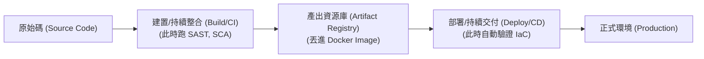

# 5.5 應用安全環境 (Apply Secure Environments)

## 學習目標

- 定義環境之間的安全隔離 (開發 Dev、測試 Test、正式線上 Prod 環境)
- 解釋持續整合與持續部署 (CI/CD) 的安全實務
- 描述應用程式環境中保護機密憑證 (secrets) 的安全管理做法
- 實作容器 (container) 與調度層 (orchestration) 的安全防護

---

## 環境隔離 (Environment Segregation)

在軟體開發生命週期 (SDLC) 的不同階段，必須切分出各自獨立、互不干擾的執行環境。這樣做是為了防止跨環境的交叉污染、保護裡面的敏感資料，並確保正式生產環境能穩若泰山。

### 各種標準環境介紹

| 環境名稱 | 主要用途 | 安全控制強度與資料類型規範 |
|-------------|---------|--------------------------------|
| **開發 (Development / Dev)** | 開發人員在本機端或共用的伺服器上撰寫並編譯程式碼的地方。 | 為了追求敏捷，此處安全控制最為寬鬆。**絕對嚴禁出現任何真實客戶資料**；只能使用假造/合成資料。此區塊本身就是個高風險區。 |
| **測試檢查 / QA (Test / QA)** | 將程式碼部署至此，以進行功能性、整合性，以及執行各種資安測試 (如 DAST) 的環境。 | 安全控制較嚴格。整體架構理應等比例縮小鏡像模擬正式環境。若因為某些極端測試非得用到真實資料，也必須先**洗掉/去識別化 (anonymized/masked)**。 |
| **預備上線 (Staging / Pre-Prod)** | 在產品正式發布出去前的最後一次總彩排。常被用來做使用者驗收測試 (UAT) 以及壓力載重測試 (load testing)。 | 其軟硬體配置以及存取控制，必須與正式環境 (Production) 做到 100% 毫無死角的心電感應般一致。 |
| **正式生產局 (Production / Prod)** | 真正對外營業，會讓真實客戶進來存取的實彈上膛環境。 | 安全控制強度達到最高極限。裡面滿布了真金白銀的客戶個資與醫療紀錄 (PII/PHI)。開發人員**絕對禁止**持有能隨時連進去 (standing access) 查看修改的常設權限。 |

### 進行環境隔離的鐵律原則

- **最小權限 (Least Privilege)**：只有被明確授權的特定人員 (通常是維運團隊)，才有資格有權限能將程式碼部署進 Prod，或是連線查閱。若是半夜臨時發布緊急除錯命令，必須啟動並遵循嚴格的「破窗/破玻璃 (break-glass)」緊急授權程序。
- **實體/邏輯層面的堅壁清野 (Physical/Logical Separation)**：各環境必須配置在不同的網段上，中間透過防火牆、VPC (虛擬私有雲)，甚至是直接使用不同的雲端訂閱帳戶進行徹頭徹尾的隔離。如果開發 (Dev) 環境不幸淪陷，**絕對不准**為駭客開啟通往 Prod 的任意門與橫向移動捷徑。
- **資料淨化清洗 (Data Sanitization)**：當你想從 Prod 把資料庫複製倒出 (cloned) 一份給下面的測試環境使用時，必須在源頭先把所有的 PII/PHI (如姓名電話身分證) 來個大清洗 (洗成匿名資料或是代碼化 tokenized)。

---

## CI/CD 管線的安全防護 (CI/CD Pipeline Security)

CI/CD (持續整合 / 持續部署) 管線，其實就是現代軟體工程的一條「全自動化生產線」。正因為這個管線握有**「無條件把程式碼硬塞進 Production 跑」**的生殺大權，它自然成了駭客發動軟體供應鏈攻擊 (supply chain attacks) 時最垂涎的頭號目標。

### 捍衛管線安全的對策

| 管線經過階段 | 必須佈署的安全控制措施 |
|----------------|------------------|
| **程式碼提交 (Source/Commit)** | 強制開啟 Pull Request 的同儕審查；設定嚴格的分支保護規則 (branch protection)；要求所有的 commit 都必須附上數位簽章 (signed commits)。 |
| **建置整合 (Build / CI)** | 在這關卡啟動 SAST 與 SCA 掃描；一旦發現有 Critical 等級的致命漏洞直接一棒敲碎 (fail the build) 不准過關；確保負責跑大夜班建置的伺服器都是用完即拋 (ephemeral) 且經過深度強固的。 |
| **產出物儲存 (Artifact Storage)** | 把編譯好的二進位檔案/映象檔鎖進防護等級超高的登錄檔庫 (registry) 裡；針對裡頭的 Image 進行 OS 層級漏洞掃描；幫這些即將出征的 Artifact 蓋上數位簽章。 |
| **發布部署 (Deployment / CD)** | 在大門口設立放行閘門 (需要手動或符合特定自動化條件才能批准放行)；採用動態的「執行期機密注入 (dynamic secrets injection)」；在動手架機器前，先對基礎設施即程式碼 (IaC) 的腳本進行資安掃描。 |

### 管線本身的存取權限控管 (Pipeline Access Control)
- 把你的 CI/CD 中央大腦伺服器 (舉凡 Jenkins、GitLab CI、GitHub Actions) 當成是**第零級別的最崇高資產 (Tier 0 critical asset)** 供奉起來。
- CI/CD 工具幫你去 AWS/Azure 佈署伺服器用的密碼/憑證，應該要設定一個打死不退的專用服務帳戶 (dedicated service accounts)，而不是讓 CI/CD 偷用某個工程師自己平常在用的私人密碼去登入。

---

## 安全的機密管理 (Secure Secrets Management)

應用程式活著就需要吃飯喝水，它們需要**機密 (secrets)** (如資料庫登入密碼、API 金鑰、TLS 數位憑證) 才能正常運作。如何將這些極度敏感的資訊，在各個環境間滴水不漏地妥善管理，是生死交關的大事。

### 糟糕透頂的反模式 (The Anti-Pattern / 錯誤示範)
把機密蠢到存放寫死在下列地方：
- 直接寫死在程式碼裡 (然後大方推上 GitHub)
- 用大字報明碼 (Plaintext) 儲存在設定檔中 (像是把 `web.config` 或 `.env` 檔案連同程式庫一起送進版控裡)
- 寫死變成 CI/CD 腳本裡寫滿字的環境變數

### 無懈可擊的安全解法 (The Secure Solution)
弄一套專業的、集中式存放的**機密金鑰庫 (Secrets Vault)** (市面上最有名的是 HashiCorp Vault、AWS Secrets Manager、Azure Key Vault、CyberArk)。

**它的運作機制堪稱完美：**
1. 應用程式剛好在正式生產環境 (Prod) 中被喚醒啟動。
2. 應用程式先拿著一個壽命極短的臨時身分證 (IAM role 或是憑證)，跑去敲 Secrets Vault 的大門進行驗明正身。
3. Vault 系統確認了「喔，你確實是我核准的應用程式」之後，就會冷不防地直接把資料庫的連線密碼，以**「即時注入應用程式執行階段的記憶體 (injects into memory at runtime)」**的雷霆手段塞進去。
4. 然後應用程式就歡天喜地連上資料庫了。而在整個過程中，**這組密碼既沒有被寫入過硬碟裡，也從來沒出現在原始碼中。** 乾乾淨淨。

**採用帶來的好處 (Benefits)**：
- 打造單一且無可辯駁的真相來源 (Single source of truth) 來收納保管所有的機密。
- 全自動化的密碼輪替與淘汰 (例如：系統會自作主張幫幾每 30 天自動變更一次資料庫管理員密碼)。
- 能留下一份鉅細靡遺的調閱紀錄 (audit logging)：清清楚楚記錄下「誰 (哪個微服務)」、「在什麼幾點幾分」、「偷看借拿了那一把鑰匙」。

---

## 容器與調度系統的最佳防禦配置 (Container and Orchestration Security)

現代那些呼風喚雨的系統架構，幾乎無不仰賴在 容器化技術 (Docker) 以及背後的總司令官 容器編排/調度平台 (Kubernetes) 身上。

### 容器的防彈計畫 (Container/Docker Security)
- **使用極簡的基礎映像檔 (Minimal Base Images)**：一開始就選用空無一物的 `scratch` 或者是瘦身極限版 `Alpine Linux` 作為基底。只帶上剛好夠用的檔案，藉此大幅剷除攻擊面 (沒有裝多餘的系統工具，駭客攻進去想作亂也找不到工具用)。
- **打死別用 Root 執行 (Run as Non-Root)**：容器內辛勤工作的程式程序 (processes)，絕對不可以被賦予擁有最高權限的 root 角色。請在 Dockerfile 裡面明確指定 `USER` 指令來降階。
- **堅持絕對不可變性 (Immutability)**：容器只要一被生下來啟動執行，它就是**「神聖不可侵犯且禁止修改」**的。當他被發現有漏洞時，**絕對不准**透過登入 SSH 跑進去下達 patch 指令；你該做的是直接把舊的打死，然後回頭修改 Dockerfile 建出一個全新的 Image，再將其重新佈署出去。
- **映像檔出海前先掃描 (Image Scanning)**：在你打算把封裝好的容器 Image 推上集散地 registry 前，務必先啟動安檢機器人裡外掃一遍，看看它裡面裝載的 OS 套件有沒有夾帶廣為人知的 CVE 老毛病。

### Kubernetes 調度指揮官的防護盾 (Orchestration Security)
- **命名空間的神聖隔離 (Namespaces)**：善用 K8s 的 namespaces 功能，在同一座叢集內，強行替不同的應用程式專案，或是替不同環境 (如切成 dev 與 staging 兩塊版圖)，畫出井水不犯河水的邏輯界線。
- **網路政策的鐵腕封鎖 (Network Policies)**：全面採用「預設一律拒絕 (default-deny)」的連網政策。規定各個微服務之間，如果沒有被明確授權「你可以跟他說話」，彼此之間就完全斷連。這是防堵駭客發動微服務橫向移動 (lateral movement) 的殺手鐧。
- **RBAC (基於角色的存取控制)**：嚴格限縮只給開發人員、或者是那些在底層默默搬磚的各種系統用 service accounts 賦予最微薄的權限。確保他們無權對 Kubernetes 的叢集指揮大腦 API 進行越權操作。

---

## 考試重點

1. **環境的生死相隔 (Environment Separation)**：正式環境 (Prod) 與開發環境 (Dev) 兩者必須維持極端徹底的實體/邏輯隔離。Prod 中的敏感資料一旦要流動降級到 Dev/QA 裡，無一例外必須經過洗資料脫敏 (masked)。
2. **門禁森嚴的生產局 (Access Control)**：除非有臨時經過核准的特殊「破玻璃除錯任務」，不然日常狀態下，開發人員根本連 Prod 大門的磁扣都不該有。
3. **無懈可擊的金鑰庫 (Secrets Vaults)**：只要考題問你密碼/API 金鑰/憑證這些極度敏感的東西到底該存哪？唯一正確解法一定是：使用一套集中存放並負責管控機密的系統金鑰庫 (vault)，然後在程式起動執行期間以「動態記憶體注入 (injected at runtime)」的方式塞給應用程式。
4. **寧死不改的不可變性 (Immutability)**：在擁抱容器化技術的世界裡，當伺服器/容器不小心生病中標漏洞時，我們**絕對不會**想辦法在它還活著運行的時候動手術打補丁修改它—我們的做法是直接開槍終結它，然後跑一次新的 CI/CD 把修好的全新版本丟上去取代它。
5. **管線防衛戰 (CI/CD Security)**：CI/CD 這條流水線本身就具有極端危險、高曝險度的「信任邊界」特性；我們必須嚴密防範並實施管控，絕對不容許有人在這裡偷改料包，結果導致惡意被污染的程式碼無聲無息地長驅直入登陸到正式環境中。

---

## 關鍵術語表

| 術語 | 定義 |
|------|-----------|
| **CI/CD** | Continuous Integration and Continuous Deployment (持續整合與持續部署的縮寫) |
| **Data Masking (資料脫敏/遮罩)** | 當必須將原本放置在最高權限區的資料庫複製挪出來給下方測試環境使用時，將當中牽涉機敏隱私的真名、卡號 (PII/PHI) 用亂碼或是假名進行替代修改模糊化的過程 |
| **Secrets Vault (機密管理金鑰庫)** | 一套被設計得極為安保森嚴、中央集權的管理系統；專門用來安全地儲存密碼或憑證，並只在應用程式真正開始啟動執行的瞬間才以動態方式將機密注入交出 |
| **Immutability (不可變性)** | 一種現代的主流架構管理哲學 — 基礎設施從它被啟動上線的那一刻起，就不允許再進行任何本地端的人工修補、更新或組態修改；要改就是整座砍掉然後發佈全新建立的版本 |
| **Container (容器)** | 這是當代軟體界用來運作和派送軟體最具代表性的、輕量級且可獨立運行的包裝技術；它裡面把應用程式需要的程式碼、執行環境甚至作業系統必要的依賴庫通通打包進一個包裹中 |
| **Orchestration (容器編排與調度)** | 負責全自動化的大管家系統工作，管家專責統籌管理電腦網路中那些千軍萬馬、數量高達幾百上千個服務容器群的繁雜日常營運 (如規模縮放派工、資源調度分配跟生病時重啟拔管)，目前名聲最響亮的當推 Kubernetes 平台 |
