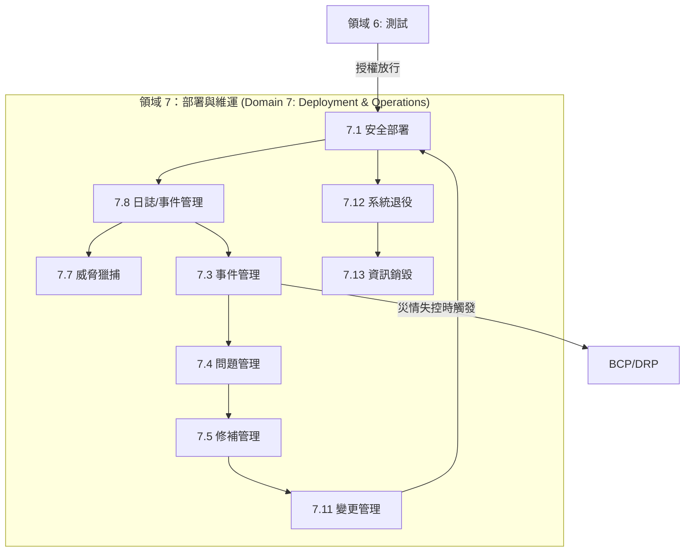

# 領域 7：安全軟體的部署、維運與維護 (Domain 7: Secure Software Deployment, Operations, and Maintenance) (14%)

## 領域總覽

領域 7 涵蓋了軟體生命週期中最漫長的一個階段：也就是當軟體被正式部署上線 (production) 之後的漫漫長夜。這個領域探討了**安全的部署實務、持續性的監控、資安事件應變、修補程式管理、營運持續計畫，以及最終的軟體安全退役與報廢。**

本領域佔**考試配重的 14%** (與其他最高配重領域並列第一)，並包含了 **13 個主要核心章節**：

| 章節 | 標題 | 學習焦點 |
|---------|-------|-------|
| 7.1 | 執行安全部署 (Perform Secure Deployment) | 安全發佈流程、開機過程安全 (boot process)、基礎設施即程式碼 (IaC) |
| 7.2 | 資安數據管理 (Security Data Management) | 資訊安全持續監控 (ISCM)、SIEM 系統 |
| 7.3 | 事件管理 (Incident Management) | 準備、偵測、根除、復原、經驗教訓 (PICERL 生命週期) |
| 7.4 | 問題管理 (Problem Management) | 根本原因分析 (RCA)、防止相同事件再次發生 |
| 7.5 | 修補與漏洞管理 (Patch & Vulnerability Management) | 緊急修補、虛擬修補 (Virtual patching)、弱點掃描 |
| 7.6 | 安全控制措施測試 (Security Control Testing) | 部署後驗證、合規性稽核檢查 |
| 7.7 | 威脅獵捕 (Threat Hunting) | 主動出擊防禦、以假說為導向的獵捕行動 (hypothesis-driven hunting) |
| 7.8 | 日誌與事件管理 (Log and Event Management) | 不可竄改的日誌記錄 (Immutable logging)、稽核、日誌聚合 |
| 7.9 | 備份與復原 (Backup and Recovery) | 資料保護、保留策略設定、RTO/RPO 指標 |
| 7.10 | BCP 與 DRP (營運持續與災難復原) | BIA 營運衝擊分析、備援演練 (熱/溫/冷站) |
| 7.11 | 變更與發佈管理 (Change & Release Management) | CAB (變更諮詢委員會) 簽核、版本控制、退版復原計畫 (rollback plans) |
| 7.12 | 產品壽命終止 / 系統退役 (End of Life / Decommissioning) | EOL 計畫、資料轉移備份、服務終止程序 |
| 7.13 | 資訊安全銷毀 (Information Disposal) | 資料徹底清除 (Purging)、消磁 (degaussing)、密碼學銷毀 (crypto-shredding) |

## 學習目標

完成本領域的學習後，您將能夠：

- 執行嚴謹的安全部署流程，包含高層簽核放行與撰寫退版復原計畫
- 建立並落實持續監控機制 (ISCM) 以及集中的日誌管理
- 安全且有條不紊地走完資安事件應變 (Incident Response) 的完整生命週期
- 清楚區分「事件管理 (Incident Management；救火)」與「問題管理 (Problem Management；抓出失火原因)」的截然不同
- 實作高效的備份策略，以及 BCP 營運持續與 DRP 災難復原計畫
- 依據安全規範將軟體除役，並將裡面的敏感資料永久、徹底地銷毀

## 核心關聯性圖解

## 備考秘笈 (Study Tips)

> **考試重點 (Exam Focus)**：高達 **14%** 的佔比，意味著考卷上會有海量的「維運情境題」。請務必滾瓜爛熟地背下**資安事件應變生命週期 (Incident Response Lifecycle)** 的每一個階段順序。必須能清楚分辨**事件 (Incident)** (撲滅眼前的火災) 與**問題 (Problem)** (找出電線走火的原因以防下次再燒起來) 這兩者在管理上的巨大差異。此外，**災難復原 (Disaster Recovery)** 中的兩大指標 (RTO vs. RPO) 是每年必考的經典聖經題，絕對不能掉分。

- **RTO (復原時間目標 Recovery Time Objective)**：系統掛掉後，我們「最遲必須在幾個小時內」把它搶修回來重新上線？ (也就是公司能忍受的最大停機時間)。
- **RPO (復原點目標 Recovery Point Objective)**：我們「最多能忍受遺失過去幾個小時的資料」？ (這個指標直接決定了你「備份的頻率」要設多密集)。
- **虛擬修補 (Virtual Patching)**：在原廠還沒釋出，或是你還無法安裝真正的程式碼修補包之前，先利用 WAF 或 IPS 寫一條攔截規則，把針對該漏洞的攻擊封包擋在門外。
- **根本原因分析 (RCA, Root Cause Analysis)**：這是「問題管理 (Problem Management)」的靈魂核心。
- **密碼學銷毀 (Crypto-shredding)**：在雲端運算環境中，要把資料「安全且徹底銷毀」的最完美手段——直接把用來加密該資料的「加密金鑰」給刪了，資料瞬間變成永遠無法還原的宇宙垃圾。

## 本區塊包含的檔案清單

| 檔案名稱 | 內容說明 |
|------|---------|
| [7.1_secure_software_deployment.md](7.1_secure_software_deployment.md) | 部署佈署策略、高層簽核、開機過程的安全防護 |
| [7.2_security_data_management.md](7.2_security_data_management.md) | 持續性監控 (ISCM)、系統遙測數據 (telemetry) |
| [7.3_incident_management.md](7.3_incident_management.md) | PICERL 生命週期、災情控制 (containment)、根除威脅 |
| [7.4_problem_management.md](7.4_problem_management.md) | 根本原因分析、連續問五次為什麼 (5 Whys)、魚骨圖 |
| [7.5_patch_vulnerability_management.md](7.5_patch_vulnerability_management.md) | SCCM 派送、虛擬修補、零日漏洞應對 |
| [7.6_security_control_testing.md](7.6_security_control_testing.md) | 部署上線後的微調校準、合規性稽核 |
| [7.7_threat_hunting.md](7.7_threat_hunting.md) | 主動防禦思維、威脅指標 (IoCs)、網路殺傷鏈 (cyber kill chain) |
| [7.8_log_event_management.md](7.8_log_event_management.md) | SIEM 系統、WORM 防竄改儲存、日誌聚合技術 |
| [7.9_backup_and_recovery.md](7.9_backup_and_recovery.md) | 完整備份/差異備份/增量備份的抉擇 |
| [7.10_bcp_and_drp.md](7.10_bcp_and_drp.md) | 營運衝擊分析 (BIA)、RTO/RPO、熱機/溫機/冷機備援站點 |
| [7.11_change_release_management.md](7.11_change_release_management.md) | CAB 變更委員會、退版復原計畫、版本號控制 |
| [7.12_eol_decommissioning.md](7.12_eol_decommissioning.md) | 落日條款與退役政策、原廠停止支援 (vendor support ending) 的衝擊 |
| [7.13_information_disposal.md](7.13_information_disposal.md) | 徹底清除 (Purging)、硬碟消磁、密碼學銷毀 (crypto-shredding) |
