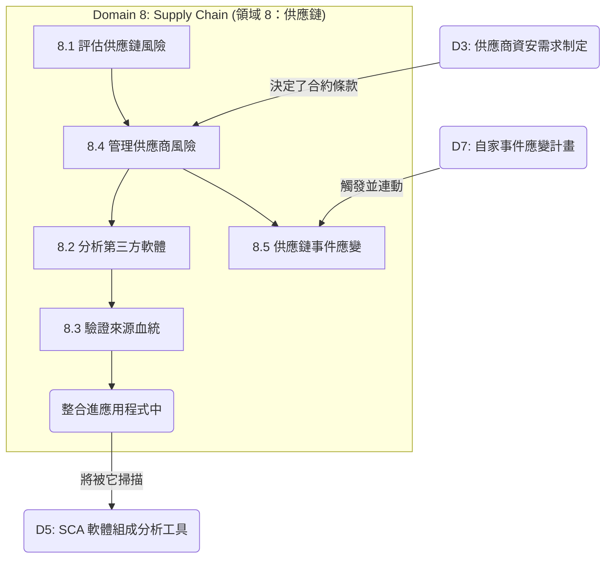

# 領域 8：安全的軟體供應鏈 (Secure Software Supply Chain) (佔比 10%)

## 領域總覽

領域 8 聚焦於現代軟體開發中潛藏的巨大風險：我們對第三方開源程式碼、開源函式庫、外部 API 以及委外開發團隊的極度依賴。現今，一場毀滅性的資料外洩，往往不需要駭客直接攻破你親手寫的程式碼；愈來愈多的駭客，選擇直接去駭入「你們家供應商所寫的程式碼」。

本領域佔 CSSLP 考試的 **10% 權重**，並包含 **5 個主要章節**：

| 章節 | 標題 | 核心焦點 |
|---------|-------|-------|
| 8.1 | 軟體供應鏈風險 (Software Supply Chain Risks) | 識別供應鏈攻擊的各種入侵管道 |
| 8.2 | 分析第三方軟體 (Analyze Third-Party Software) | 開源軟體授權合約、軟體組成分析 (SCA)、以及弱點發掘 |
| 8.3 | 驗證來源與完整性 (Verify Provenance and Integrity) | 數位簽章、雜湊值 (Hashes)、軟體物料清單 (SBOMs) |
| 8.4 | 管理供應商風險 (Manage Supplier Risk) | 供應商資安評估、服務級別協議 (SLA)、合約條款 |
| 8.5 | 供應鏈事件應變 (Supply Chain Incident Response) | 將供應商遭駭客洩密的慘劇，整合進你自家的事件應變計畫中 |

## 學習目標

完成本領域後，您應該能夠：

- 深刻理解現代軟體供應鏈所面臨的恐怖威脅 (例如：SolarWinds 供應鏈攻擊事件、Log4j 漏洞風暴)
- 分析第三方外包程式碼中的資安漏洞與版權授權衝突
- 建立並驗證下載回來的軟體套件的「來源血統 (Provenance)」與「檔案完整性 (Integrity)」
- 控管由委外供應商與第三方套件所引進的系統性風險
- 當一家掌握你們命脈的關鍵供應商不幸遭駭時，能有效且迅速地進行應變

## 關鍵關聯圖 (Key Relationships)

## 備考秘訣 (Study Tips)

> **考試重點 (Exam Focus)**：供應鏈安全是整個網路安全領域中。進化速度最狂飆的一個分支。你**絕對、必須**徹底搞懂什麼是 **軟體物料清單 (SBOM, Software Bill of Materials)** —— 考卷上幾乎 100% 保證會考這個。請務必分清楚這兩個單字的差異：**來源血統 Provenance** (這包檔案到底是哪個爹娘生出來的？) 以及 **完整性 Integrity** (這包檔案在運送途中有沒有被人偷偷動過手腳？)。最後，永遠記住業界的一句鐵律：**「你可以把繁重的工作外包，但你永遠無法把『風險』外包 (you can outsource the work, but you cannot outsource the risk)」**。如果你的外包廠商被駭客攻破，導致你們客戶的個資外洩，在法律與賠償責任上，抬不起頭的還是「你」。

- **SBOM (軟體物料清單)**：一份鉅細靡遺的超級清單，清楚列出你的軟體肚子裡到底吃進了哪些第三方開源組件。這對災難發生時的事件應變 (IR) 來說是救命神藥。
- **SCA (軟體組成分析工具)**：用來全自動生成 SBOM，並拿這份清單去比對全世界已知漏洞資料庫 (CVEs) 的自動化掃描大砲。
- **相依性困惑攻擊 (Dependency Confusion)**：一種高明的駭客招式。駭客在公開的開源套件庫上，故意發布一個帶有病毒、但名稱卻跟你們公司內部私有套件「一模一樣」的假套件；藉此欺騙你們工程師的套件管理系統 (如 npm)，讓它誤以為這個外面來的假套件是最新版本，進而把木馬下載回公司內網。
- **稽核權 (Right to Audit)**：在簽署採購合約時，一個絕對不可讓步的保命條款；它強制供應商必須乖乖開門，讓你定期派人進去檢查他們的資安有沒有做好。

## 本章節的檔案清單

| 檔案名稱 | 內容說明 |
|------|---------|
| [8.1_supply_chain_risks.md](8.1_supply_chain_risks.md) | 第三方函式庫、委外開發風險、各種供應鏈攻擊入侵管道 |
| [8.2_analyze_third_party_software.md](8.2_analyze_third_party_software.md) | 開源軟體風險、版權授權地雷 (GPL vs. MIT)、SCA 自動化組成分析工具 |
| [8.3_verify_provenance_integrity.md](8.3_verify_provenance_integrity.md) | 密碼學雜湊函數、GPG 數位簽章、SBOM 的兩大格式 (CycloneDX / SPDX) |
| [8.4_manage_supplier_risk.md](8.4_manage_supplier_risk.md) | 供應商資安風險評估、SLA 服務水準協議、稽核權條款 |
| [8.5_supply_chain_incident_response.md](8.5_supply_chain_incident_response.md) | 聯合災難防禦計畫、程式碼託管 (Code Escrow)、資安事件的對外溝通通報機制 |
